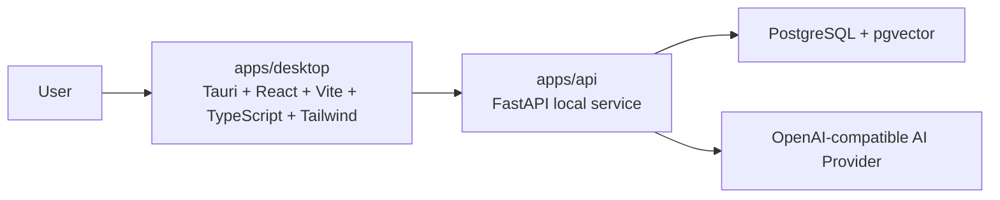
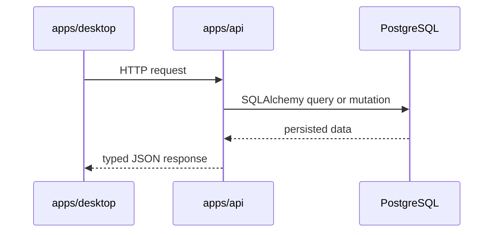
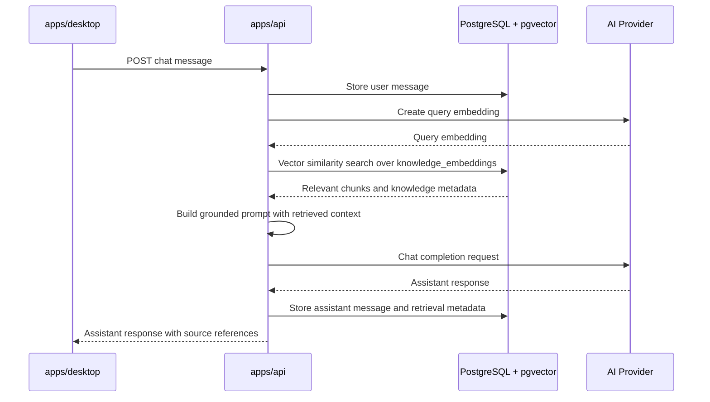

# Asteria / 星识 架构文档

## 架构定位

Asteria / 星识 是 desktop-first 应用。

桌面应用是产品主体；本地 FastAPI 是应用服务层；PostgreSQL + pgvector 是持久化和向量检索层；AI Provider 只能通过后端适配器访问。

前端应该像本地 API 的客户端，而不是一个 full-stack Web 应用。

## 高层拓扑

## 应用边界

### apps/desktop

`apps/desktop` 负责：

- Tauri 桌面壳和窗口生命周期。
- React 页面、组件、客户端状态和 UI 交互。
- 通过 HTTP 调用本地 FastAPI。
- 渲染 conversations、knowledge units、projects、settings 和 diagnostics。
- 必要时通过 Tauri commands 处理桌面能力，例如未来的本地文件选择、应用生命周期、系统集成等。

`apps/desktop` 不负责：

- 数据库连接。
- SQL 查询。
- SQLAlchemy models 或 Alembic migrations。
- AI Provider SDK 或 HTTP 调用。
- embedding 生成。
- RAG 检索、prompt 构造或 Provider 响应解析。
- 除基础表单校验之外的 Provider secret 校验。

### apps/api

`apps/api` 负责：

- FastAPI routes 和 request/response contracts。
- SQLAlchemy ORM models 和 database sessions。
- Alembic migrations。
- conversations、messages、knowledge units、tags、projects、providers、settings 的业务规则。
- AI Provider abstraction 和具体 Provider adapter。
- embedding 生成。
- 基于 pgvector 的语义检索。
- RAG orchestration。
- Provider 调用的校验、规范化和错误处理。

`apps/api` 不负责：

- 桌面窗口管理。
- React 组件状态。
- Tauri shell 配置。
- 页面视觉布局或 UI 路由。

## 硬性规则

- 前端不直接访问 PostgreSQL。
- 前端不直接调用 OpenAI、OpenAI-compatible endpoint 或任何 AI Provider SDK。
- 前端只通过本地 FastAPI 获取应用数据和 AI 行为。
- 后端是唯一读写数据库的层。
- 后端是唯一理解 Provider 特定 request/response 格式的层。
- Tauri commands 只用于桌面集成，不用于绕过后端业务逻辑。

## 数据流

### 普通 CRUD 流程

### RAG 流程

## RAG 职责

后端 RAG service 负责：

- 选择 active AI Provider。
- 为用户 query 创建 embedding。
- 通过 pgvector 检索 `knowledge_embeddings`。
- 在请求提供 project 或 tag filter 时应用过滤。
- 读取被检索 chunk 对应的 `knowledge_units`。
- 构造区分 user input、retrieved context 和 system instructions 的 prompt。
- 通过 Provider abstraction 调用 chat model。
- 向前端返回 answer text 和 source metadata。
- 持久化 user message 和 assistant message。

前端只负责：

- 发送用户消息和筛选条件。
- 渲染 assistant answer。
- 渲染后端返回的 source references。
- 展示 loading、error 和 retry 状态。

## AI Provider 抽象

Asteria / 星识 使用 OpenAI-compatible Provider abstraction，避免 Provider 细节泄漏到 UI。

后端抽象需要覆盖：

- Chat completion。
- Embedding creation。
- Provider health check。
- 可用时的 model metadata。
- 标准化错误映射。

Provider 配置存储在 `ai_providers` 中，active provider 可通过 `app_settings` 或后端配置选择。

Provider adapter 需要规范化：

- Base URL。
- API key 或本地 Provider credential 行为。
- Chat model name。
- Embedding model name。
- Embedding dimension。
- Request timeout。
- Retry behavior。
- 返回给 UI 的错误信息。

MVP 可以只实现一个 OpenAI-compatible HTTP adapter。后续新增 Provider 时，必须接在同一后端接口之后，不改变前端调用方式。

## 开发期运行方式

开发期使用 Docker Compose 提供基础设施：

- PostgreSQL with pgvector。
- 未来如有需要，可加入数据库管理工具。

开发流程：

1. 使用 Docker Compose 启动 PostgreSQL。
2. 在 `apps/api` 中运行 Alembic migrations。
3. 使用 `uvicorn` 启动 FastAPI。
4. 启动 Vite dev server。
5. 启动 Tauri 桌面应用，并连接本地 Vite 和 FastAPI 服务。

## 未来打包方向

未来桌面打包可能将 FastAPI 作为 Tauri sidecar，或替换为其他本地服务分发方式。无论打包方式如何变化，应用边界不应改变：

- Desktop UI 仍然是客户端。
- API 仍然是业务和 AI 层。
- Database 仍然在 API 后面。
- Provider 调用仍然在 API abstraction 后面。
