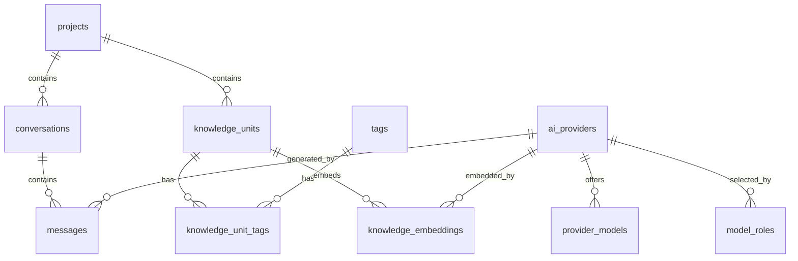

# Asteria / 星识 数据库 Schema

## 范围

本文档定义 Asteria / 星识 MVP 的持久化模型。

数据库技术栈：

- PostgreSQL
- pgvector
- SQLAlchemy ORM
- Alembic migrations

必需 PostgreSQL extensions：

```sql
CREATE EXTENSION IF NOT EXISTS pgcrypto;
CREATE EXTENSION IF NOT EXISTS vector;
```

前端不能直接连接数据库。所有读写必须经过 `apps/api`。

## 实体关系概览



## 命名约定

- 主键使用 `uuid`。
- 时间字段使用 `timestamptz`。
- 可变业务表包含 `created_at` 和 `updated_at`。
- 需要归档的表使用 nullable `archived_at`。
- 灵活元数据使用 `jsonb`。
- 数据库约束应负责保证归属关系、唯一性和枚举值合法性。

## Table: projects

projects 用于按工作上下文组织 conversations 和 knowledge units。

| 字段 | 类型 | 必填 | 说明 |
| --- | --- | --- | --- |
| `id` | `uuid` | 是 | 主键，默认 `gen_random_uuid()` |
| `name` | `text` | 是 | 项目名称 |
| `description` | `text` | 否 | 项目描述 |
| `color` | `text` | 否 | UI color token 或 hex color |
| `sort_order` | `integer` | 是 | 手动排序，默认 `0` |
| `created_at` | `timestamptz` | 是 | 创建时间，默认 `now()` |
| `updated_at` | `timestamptz` | 是 | 更新时间，默认 `now()` |
| `archived_at` | `timestamptz` | 否 | 为空表示 active |

关系：

- 一个 project 可以包含多个 conversations。
- 一个 project 可以包含多个 knowledge units。

索引：

- `id` primary key。
- active project name 的唯一索引，建议使用 `lower(name)`。
- `archived_at` 索引。
- `sort_order` 索引。

约束：

- `trim(name)` 不能为空。
- `sort_order >= 0`。

## Table: repositories

repositories 存储本地 Repository / Vault 注册信息。它是仓库注册与当前仓库恢复的后端权威；`.asteria` 目录可以作为本地标记或后续配置入口，但 MVP 不把它作为唯一权威。

Repository / Vault 与 Project 是独立概念线。Repository 表只描述本地文件系统 root，不承载 Project、Conversation、Knowledge 或 AI Provider 配置关系。

| 字段 | 类型 | 必填 | 说明 |
| --- | --- | --- | --- |
| `id` | `uuid` | 是 | 主键，默认 `gen_random_uuid()` |
| `name` | `text` | 是 | 用户可见仓库名称 |
| `root_path` | `text` | 是 | 本地文件系统根目录的规范化绝对路径 |
| `status` | `text` | 是 | `active` 或 `unlinked`，默认 `active` |
| `created_at` | `timestamptz` | 是 | 创建时间，默认 `now()` |
| `updated_at` | `timestamptz` | 是 | 更新时间，默认 `now()` |
| `unlinked_at` | `timestamptz` | 否 | unlink 注册关系的时间；为空表示仍 active |

索引：

- `id` primary key。
- active repository name 的唯一索引，使用 `lower(name)` 且仅覆盖 `status = 'active'`。
- active repository root path 的唯一索引，使用 `lower(root_path)` 且仅覆盖 `status = 'active'`。
- `status` 索引。

约束：

- `trim(name)` 不能为空。
- `trim(root_path)` 不能为空。
- `status IN ('active', 'unlinked')`。
- 当 `status = 'unlinked'` 时，`unlinked_at` 必须非空。

## Table: conversations

conversations 存储聊天会话，可选关联 project。

| 字段 | 类型 | 必填 | 说明 |
| --- | --- | --- | --- |
| `id` | `uuid` | 是 | 主键，默认 `gen_random_uuid()` |
| `project_id` | `uuid` | 否 | 外键到 `projects.id`，`ON DELETE SET NULL` |
| `title` | `text` | 是 | 会话标题 |
| `summary` | `text` | 否 | 可选摘要 |
| `metadata` | `jsonb` | 是 | UI 或 retrieval 元数据，默认 `{}` |
| `created_at` | `timestamptz` | 是 | 创建时间，默认 `now()` |
| `updated_at` | `timestamptz` | 是 | 更新时间，默认 `now()` |
| `archived_at` | `timestamptz` | 否 | 为空表示 active |

关系：

- 多个 conversations 可以属于一个 project。
- 一个 conversation 包含多个 messages。

索引：

- `id` primary key。
- `project_id` 索引。
- `updated_at DESC` 索引。
- active conversations partial index：`WHERE archived_at IS NULL`。

约束：

- `trim(title)` 不能为空。
- `metadata` 必须是 JSON object，默认 `{}`。

## Table: messages

messages 存储 conversation 中的 user、assistant、system 或 tool 消息。

| 字段 | 类型 | 必填 | 说明 |
| --- | --- | --- | --- |
| `id` | `uuid` | 是 | 主键，默认 `gen_random_uuid()` |
| `conversation_id` | `uuid` | 是 | 外键到 `conversations.id`，`ON DELETE CASCADE` |
| `provider_id` | `uuid` | 否 | 外键到 `ai_providers.id`，`ON DELETE SET NULL` |
| `role` | `text` | 是 | `system`、`user`、`assistant` 或 `tool` |
| `content` | `text` | 是 | 消息正文 |
| `model` | `text` | 否 | assistant 或 tool 输出使用的模型 |
| `token_count` | `integer` | 否 | 可选 token 估算或 Provider 返回值 |
| `retrieval_metadata` | `jsonb` | 是 | RAG sources、scores 和 chunk references，默认 `{}` |
| `created_at` | `timestamptz` | 是 | 创建时间，默认 `now()` |

关系：

- 多个 messages 属于一个 conversation。
- assistant messages 可以引用生成它的 provider。

索引：

- `id` primary key。
- `(conversation_id, created_at)` 复合索引。
- `provider_id` 索引。
- 如果需要按 source metadata 查询，可为 `retrieval_metadata` 添加 GIN 索引。

约束：

- `role` 必须是 `system`、`user`、`assistant`、`tool` 之一。
- `trim(content)` 不能为空。
- `token_count` 必须为空或 `>= 0`。
- `retrieval_metadata` 必须是 JSON object，默认 `{}`。

## Table: knowledge_units

knowledge_units 是用户沉淀的核心知识记录，也是 RAG 检索的主要来源。

| 字段 | 类型 | 必填 | 说明 |
| --- | --- | --- | --- |
| `id` | `uuid` | 是 | 主键，默认 `gen_random_uuid()` |
| `project_id` | `uuid` | 否 | 外键到 `projects.id`，`ON DELETE SET NULL` |
| `title` | `text` | 是 | 知识标题 |
| `content` | `text` | 是 | 知识正文 |
| `source_type` | `text` | 是 | `manual`、`import`、`chat` 或 `excerpt`；MVP 默认 `manual` |
| `source_uri` | `text` | 否 | 可选本地路径、URL 或来源标识 |
| `status` | `text` | 是 | `active` 或 `archived`，默认 `active` |
| `metadata` | `jsonb` | 是 | 可选结构化元数据，默认 `{}` |
| `created_at` | `timestamptz` | 是 | 创建时间，默认 `now()` |
| `updated_at` | `timestamptz` | 是 | 更新时间，默认 `now()` |
| `archived_at` | `timestamptz` | 否 | 为空表示 active |

关系：

- 多个 knowledge units 可以属于一个 project。
- 一个 knowledge unit 可以通过 `knowledge_unit_tags` 拥有多个 tags。
- 一个 knowledge unit 可以在 `knowledge_embeddings` 中拥有多个 embedding chunks。

索引：

- `id` primary key。
- `project_id` 索引。
- `updated_at DESC` 索引。
- `status` 索引。
- 针对 `title` 和 `content` 的 GIN full-text index。
- 如果引入 metadata filter，可为 `metadata` 添加 GIN 索引。

约束：

- `trim(title)` 不能为空。
- `trim(content)` 不能为空。
- `source_type` 必须是 `manual`、`import`、`chat`、`excerpt` 之一。
- `status` 必须是 `active` 或 `archived`。
- 当 `status = 'archived'` 时，`archived_at` 应非空。
- `metadata` 必须是 JSON object，默认 `{}`。

## Table: tags

tags 是可复用标签，用于组织 knowledge units。

| 字段 | 类型 | 必填 | 说明 |
| --- | --- | --- | --- |
| `id` | `uuid` | 是 | 主键，默认 `gen_random_uuid()` |
| `name` | `text` | 是 | 显示名称 |
| `slug` | `text` | 是 | 小写、URL-safe 的唯一标识 |
| `color` | `text` | 否 | UI color token 或 hex color |
| `created_at` | `timestamptz` | 是 | 创建时间，默认 `now()` |

关系：

- 一个 tag 可以通过 `knowledge_unit_tags` 绑定多个 knowledge units。

索引：

- `id` primary key。
- `lower(name)` unique index。
- `slug` unique index。

约束：

- `trim(name)` 不能为空。
- `trim(slug)` 不能为空。
- `slug` 必须匹配 `^[a-z0-9]+(-[a-z0-9]+)*$`，即只包含小写字母、数字和内部连字符，且不能以连字符开头或结尾。

## Table: knowledge_unit_tags

knowledge_unit_tags 是 knowledge units 和 tags 的多对多关系表。

| 字段 | 类型 | 必填 | 说明 |
| --- | --- | --- | --- |
| `knowledge_unit_id` | `uuid` | 是 | 外键到 `knowledge_units.id`，`ON DELETE CASCADE` |
| `tag_id` | `uuid` | 是 | 外键到 `tags.id`，`ON DELETE CASCADE` |
| `created_at` | `timestamptz` | 是 | 创建时间，默认 `now()` |

关系：

- 表示 knowledge units 和 tags 的 many-to-many relationship。

索引：

- `(knowledge_unit_id, tag_id)` composite primary key。
- `tag_id` 索引。
- `knowledge_unit_id` 索引。

约束：

- 同一个 knowledge unit 不能重复绑定同一个 tag。
- 删除 knowledge unit 时删除对应 join rows。
- 删除 tag 时删除对应 join rows。

## Table: knowledge_embeddings

knowledge_embeddings 存储 knowledge unit 的切片向量，用于语义检索。

MVP 假设同一个数据库中只使用一个 active embedding dimension。默认目标为 `1536`，对应常见 OpenAI-compatible embedding model。未来如需更换维度，需要重新生成 embeddings 或设计迁移策略。

| 字段 | 类型 | 必填 | 说明 |
| --- | --- | --- | --- |
| `id` | `uuid` | 是 | 主键，默认 `gen_random_uuid()` |
| `knowledge_unit_id` | `uuid` | 是 | 外键到 `knowledge_units.id`，`ON DELETE CASCADE` |
| `provider_id` | `uuid` | 否 | 外键到 `ai_providers.id`，`ON DELETE SET NULL` |
| `embedding_model` | `text` | 是 | 生成向量的模型 |
| `embedding_dimension` | `integer` | 是 | 向量维度，默认 `1536` |
| `chunk_index` | `integer` | 是 | knowledge unit 内的零基 chunk 顺序 |
| `chunk_text` | `text` | 是 | 该向量对应的文本片段 |
| `content_hash` | `text` | 是 | 规范化 chunk 文本和 embedding 配置的 hash |
| `embedding` | `vector(1536)` | 是 | pgvector 向量 |
| `created_at` | `timestamptz` | 是 | 创建时间，默认 `now()` |
| `updated_at` | `timestamptz` | 是 | 更新时间，默认 `now()` |

关系：

- 多个 embedding chunks 属于一个 knowledge unit。
- embedding chunks 可以引用生成它的 provider。

索引：

- `id` primary key。
- `knowledge_unit_id` 索引。
- `provider_id` 索引。
- `(knowledge_unit_id, embedding_model, content_hash, chunk_index)` unique index。
- 使用 cosine distance 的 HNSW vector index。

MVP vector index：

```sql
CREATE INDEX ix_knowledge_embeddings_embedding_cosine
ON knowledge_embeddings
USING hnsw (embedding vector_cosine_ops);
```

约束：

- MVP 中 `embedding_dimension = 1536`。
- `chunk_index >= 0`。
- `trim(chunk_text)` 不能为空。
- `trim(content_hash)` 不能为空。

## Table: ai_providers

ai_providers 存储后端拥有的 OpenAI-compatible Provider 配置。

| 字段 | 类型 | 必填 | 说明 |
| --- | --- | --- | --- |
| `id` | `uuid` | 是 | 主键，默认 `gen_random_uuid()` |
| `name` | `text` | 是 | 用户可见 Provider 名称 |
| `provider_type` | `text` | 是 | MVP 值：`openai_compatible` |
| `base_url` | `text` | 是 | Provider API base URL |
| `api_key_ciphertext` | `text` | 否 | 使用后端 secret key 加密后的 API key；无 key 的本地 Provider 可为空 |
| `chat_model` | `text` | 是 | 兼容字段：默认 chat model；v0.10.0 后 UI 使用 `provider_models` |
| `embedding_model` | `text` | 是 | 兼容字段：默认 embedding model；本地 embedding 方案后续替换 |
| `embedding_dimension` | `integer` | 是 | 默认 embedding dimension，MVP 默认 `1536` |
| `timeout_seconds` | `integer` | 是 | 请求超时时间，默认 `60` |
| `metadata` | `jsonb` | 是 | 非 secret 的 Provider 元数据，默认 `{}` |
| `created_at` | `timestamptz` | 是 | 创建时间，默认 `now()` |
| `updated_at` | `timestamptz` | 是 | 更新时间，默认 `now()` |

关系：

- messages 可以引用生成它的 provider。
- knowledge_embeddings 可以引用生成它的 provider。
- provider_models 记录该 Provider 可供 Chat 模型角色选择的模型名称。

索引：

- `id` primary key。
- `lower(name)` unique index。

约束：

- MVP 中 `provider_type = 'openai_compatible'`。
- `name`、`base_url`、`chat_model`、`embedding_model` trim 后不能为空。
- MVP 中 `embedding_dimension = 1536`。
- `timeout_seconds` 必须在 `1` 到 `300` 之间。
- `metadata` 必须是 JSON object，默认 `{}`。
- API key 不能明文存储。

## Table: provider_models

provider_models 存储每个 OpenAI-compatible Provider 暴露或由用户手动登记的模型名称。Provider 本身只是 API 服务配置；具体 Chat 模型角色从这些模型中选择。

| 字段 | 类型 | 必填 | 说明 |
| --- | --- | --- | --- |
| `id` | `uuid` | 是 | 主键，默认 `gen_random_uuid()` |
| `provider_id` | `uuid` | 是 | 外键到 `ai_providers.id`，`ON DELETE CASCADE` |
| `name` | `text` | 是 | 模型名称，例如 `deepseek-v4-pro` |
| `sort_order` | `integer` | 是 | Provider 内部显示顺序，默认 `0` |
| `created_at` | `timestamptz` | 是 | 创建时间，默认 `now()` |
| `updated_at` | `timestamptz` | 是 | 更新时间，默认 `now()` |

关系：

- provider_models 属于一个 ai_provider。
- Chat model role 必须引用某个 Provider 已登记的模型名称。

索引：

- `id` primary key。
- `(provider_id, lower(name))` unique index。
- `provider_id` index。

约束：

- `trim(name)` 不能为空。
- `sort_order >= 0`。

## Table: model_roles

model_roles 存储任务角色到模型的选择关系。v0.10.0 中 `chat` 角色选择远程 Provider 模型；`embedding` 角色作为本地模型方案入口，实际本地模型运行延后。

| 字段 | 类型 | 必填 | 说明 |
| --- | --- | --- | --- |
| `id` | `uuid` | 是 | 主键，默认 `gen_random_uuid()` |
| `role_type` | `text` | 是 | `chat` 或 `embedding` |
| `provider_id` | `uuid` | 否 | `chat` 角色引用 `ai_providers.id`；`embedding` 角色必须为空 |
| `model_name` | `text` | 是 | 选中的模型名称 |
| `embedding_dimension` | `integer` | 否 | 本地 embedding 方案的目标维度 |
| `created_at` | `timestamptz` | 是 | 创建时间，默认 `now()` |
| `updated_at` | `timestamptz` | 是 | 更新时间，默认 `now()` |

约束：

- `role_type IN ('chat', 'embedding')`。
- `role_type` unique，确保每个角色最多一条配置。
- `provider_id` 外键为 `ON DELETE SET NULL`。

## Table: app_settings

app_settings 存储本地应用偏好和当前选中的 ID。

| 字段 | 类型 | 必填 | 说明 |
| --- | --- | --- | --- |
| `key` | `text` | 是 | 主键 |
| `value` | `jsonb` | 是 | JSON value |
| `updated_at` | `timestamptz` | 是 | 更新时间，默认 `now()` |

推荐 MVP keys：

- `active_provider_id`
- `active_project_id`
- `current_repository_id`
- `theme`
- `rag.default_top_k`
- `rag.max_context_chunks`

索引：

- `key` primary key。
- 只有当需要查询 settings value 时，才为 `value` 增加 GIN index。

约束：

- `trim(key)` 不能为空。
- `value` 必须是合法 JSON。
- secrets 不应存储在 `app_settings` 中。

## Migration 要求

Alembic migrations 应满足：

- 先创建 extensions，再创建 vector columns。
- 按依赖顺序创建 tables。
- 在数据表存在后创建 vector indexes。
- 在可行时提供 downgrade steps。
- 不在测试 fixtures 中泄漏 Provider secrets。

## 删除与归档策略

- conversations 和 knowledge units 的普通 UI 流程应使用 archive。
- hard delete 只用于开发清理或用户明确触发的破坏性操作。
- 删除 conversation 时 cascade 删除 messages。
- 删除 knowledge unit 时 cascade 删除 tag joins 和 embeddings。
- 删除 tag 时只 cascade 删除 join rows。
- 删除 project 时将相关 `project_id` 设置为 null。
